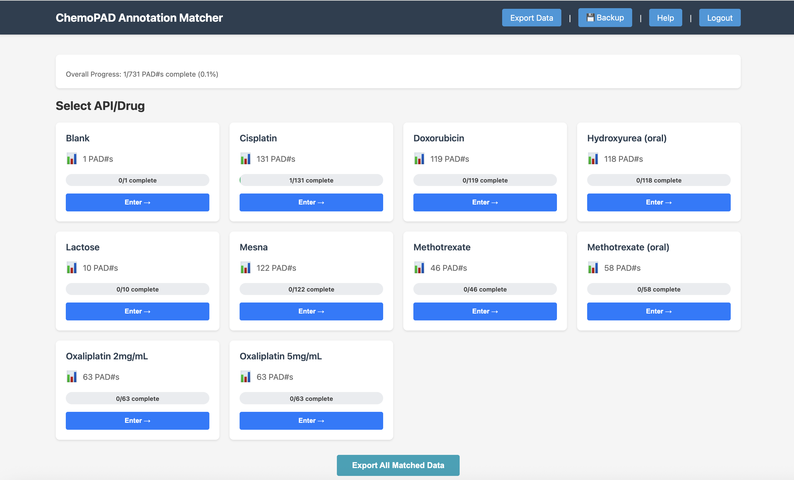
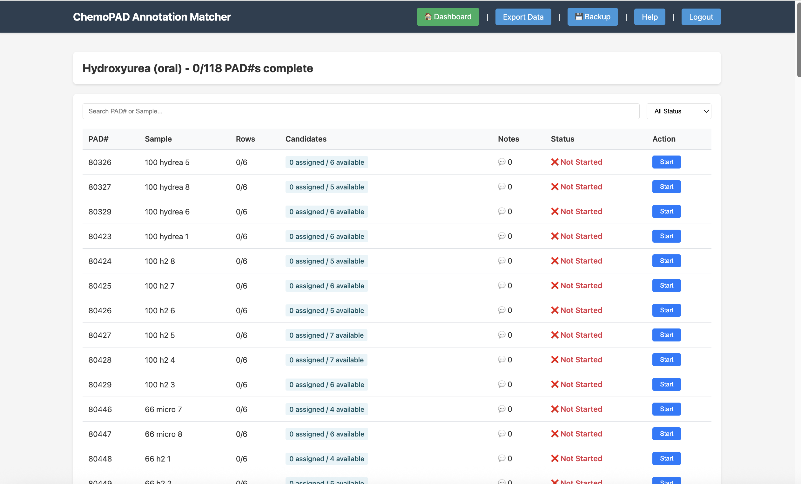
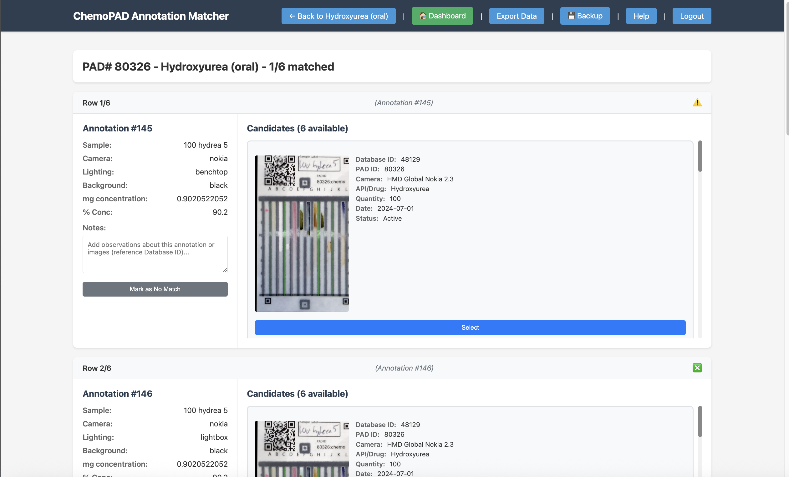
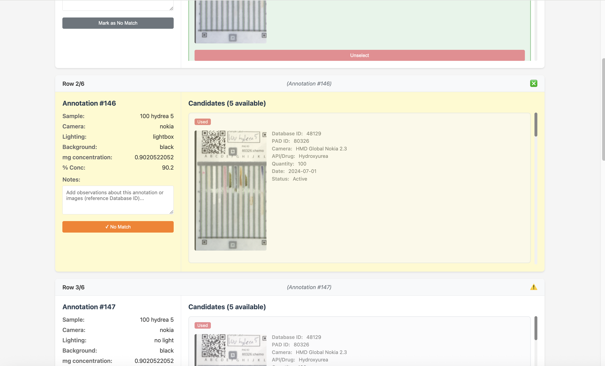
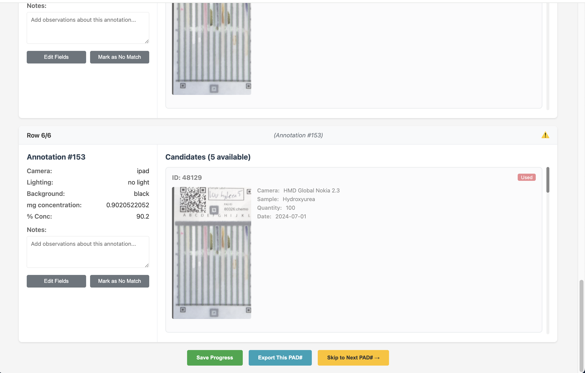

# ChemoPAD Annotation Matcher - Quick Start Guide

Welcome! This guide will help you get started with the ChemoPAD Annotation Matcher via the web interface.

## Accessing the Application

Open your web browser and go to:

```
http://pad-annotation.crc.nd.edu:8080/
```

The application is already running on the VM, so you can start using it immediately.

## Step 1: Select an API/Drug

When you first open the application, you'll see the **Dashboard** with all available drugs/APIs.



**What you see:**
- Cards for each drug (Blank, Cisplatin, Doxorubicin, Hydroxyurea (oral), etc.)
- Number of annotations for each drug
- Progress bar showing completion percentage
- "Enter" button to start working on that drug

**What to do:**
1. Choose a drug you want to work on
2. Click the "Enter" button

## Step 2: Review the Annotation List

After clicking "Enter", you'll see a list of all annotations that need to be matched for that drug.



**Table columns:**
- **PAD#**: Unique identifier for each annotation
- **Sample**: Sample information from the annotation
- **Rows**: Progress indicator (e.g., 0/6 means you've matched 0 out of 6 rows)
- **Status**: Shows if the annotation is complete, partial, or not started
- **Action**: "Start" button to begin matching

**How to navigate:**
- Use the search box to find specific PAD# or sample names
- Use the "All Status" dropdown to filter by completion status
- Click "Start" on any row to begin matching

## Step 3: Match Annotations

Click "Start" on an annotation to open the **Matching Interface**.



**Left Panel - Your Annotation:**
Shows the annotation details:
- Camera type (e.g., nokia)
- Lighting conditions
- Background color
- Concentrations
- Notes field for your observations

**Right Panel - Candidate Matches:**
Shows potential matches from the dataset:
- Image preview (if available)
- Candidate ID
- Camera type, sample name, quantity, date
- "Select" button to choose this candidate

### How to Make a Match

**Step A: Review Your Annotation**
Look at the left panel and understand what you're trying to match:
- What camera was used?
- What was the sample?
- What are the key identifiers?

**Step B: Review Candidates**
Scroll through candidates on the right panel:
- Compare images when available
- Check if camera type and sample match
- Look for any identifying features (QR codes, labels, etc.)

**Step C: Select a Match**
Click the **"Select"** button on the correct candidate.

The card will turn green showing it's selected.

### Adding Notes (Optional)

If you want to record observations:
1. Click in the **Notes** text area
2. Type your observations
3. Click "Save Note" to persist your comment

Examples of useful notes:
- "Image quality confirms match"
- "Different lighting but same sample"
- "Potential issue: camera type mismatch"

### No Match Found?

If no candidate matches your annotation:



1. Click the **"Mark as No Match"** button
2. The button turns orange showing it's marked
3. You can still add notes if needed

### Save Your Work

Click **"Save Match"** to record your selection and move to the next annotation.

If you want to skip without saving, click **"Skip"**.

## Step 4: Export Your Results

When you're ready to download your matched data:



1. Go back to the annotation list (click "Back to [Drug Name]")
2. Scroll to the bottom
3. Click **"Export All Matched Data"**
4. A CSV file will be downloaded with:
   - All original annotation data
   - **matched_id**: The dataset entry ID (or "no_match")
   - **matched_sample_id**: The sample ID
   - Matched dataset information
   - Any notes you added
   - Data quality flags

The file is named: `chemopad_matched_export_YYYYMMDD_HHMMSS.csv`

## Progress Tracking

Your work is automatically saved as you go. You can:
- **Resume later**: Your progress is preserved across sessions
- **Check completion**: See the progress bar to track how many annotations are complete
- **Work on multiple drugs**: Switch between drugs using the Dashboard

## Tips for Successful Matching

1. **Always review images** - Visual verification is crucial for accurate matches
2. **Check camera types** - Different cameras of the same sample should have similar characteristics
3. **Use notes for edge cases** - Document any ambiguities or special observations
4. **Be careful with selection** - Only select if you're confident it's the right match
5. **If unsure, mark as "No Match"** - It's better to not match than to make a wrong match
6. **Review before exporting** - Check your work to ensure matches are reasonable

## Common Questions

**Q: Can I change a match I already made?**
A: Yes! Go back to that annotation in the list, select a different candidate or mark as "No Match", and click "Save Match" to update.

**Q: What if the image isn't loading?**
A: Check your internet connection. Images are loaded from the remote server. Try refreshing the page.

**Q: Can I work on multiple annotations in one session?**
A: Yes! After you save a match, the next annotation loads automatically. You can work continuously.

**Q: What happens to my progress if I close the browser?**
A: Your progress is automatically saved. When you come back, you'll see your previous work and can continue from where you left off.

**Q: How do I know if a candidate is already used?**
A: Candidates that are already matched to other annotations have a red "Used" badge. You cannot select these.

## Getting Help

If you encounter any issues:
1. Check the "Tips for Successful Matching" section above
2. Try refreshing your browser
3. Verify your internet connection
4. Contact the pmoreie@crc.nd.edu for technical support

---

**Access URL**: http://pad-annotation.crc.nd.edu:8080/
**Version**: Flask-based web interface
**Last Updated**: October 2025
